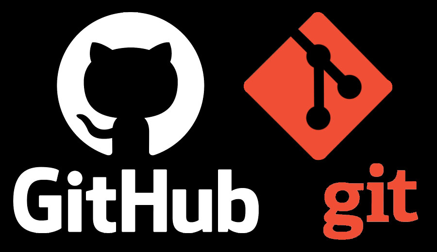

# Работа с Git и GitHub

## Выбрать язык отображения VSC.
1. Нажать: `ctrl+shift+P`
2. Ввести: `Configure Display Language`
3. Выбрать удобный язык.

## 1. Проверка наличия установленного Git
В терминале выполнить команду `git --version`.

Если Git установлен, появится сообщение с информацией о версии программы. Иначе будет сообщение  об ошибке.

## 2. Установка Git
Загружаем последнюю версию с сайта:

https://git-scm.com/downloads

Устанавливаем с настройками по умолчанию.

## 3. Настроить Git
При первом использовании Git необходимо представиться. Для этого нужно ввести в терминале 2 команды:
```
git config --global user.name «Ваше имя английскими буквами»

git config --global user.email ваша почта@example.com
```

## 4. Инициализация репозитория
Для начала отслеживания проекта - необходими инициализировать репозитарий.
Для инициализации ведите команду: `git init`.

## 5. Запись изменений в репозитории
Для записи изменений в проекте - необходимо выполнить следующие команды:

`git add имя файла` (*не обяpательно писать весь файл, достаточно ввести первый буквы названия файла и нажать* **tab**) - добавляет изменение из рабочего каталога в раздел проиндексированных файлов.

`git commit -m` - записать изменения и оставить комментарий к ним.

`git add .` (*без указания названия файлов*) - добавляет изменения индексации файлов во всей папке и всех подпапках.
`git commit -amend` - позволяет заменить последний комментарий. 

*Пример написания команды*:
`git commit -amend -am "Правильный commit"`

### Альтернативная запись команд:
`git add . + git commit - m` =  `git commit - a - m ` =  `git commit - am `

## 6.Просмотр изменения commit.
Для просмотра всех commit - необходимо выполнить следующие команды:
`git log`
### Варианты использоавния git log:
1. `git log --graph` - выводит дерево commit
2. `git log --oneline` - выводит commit в упращенном виде построчно
3. `git reflog` - показывает историю перемещения метки HEAD (*последний commit из работчей версии*)

## 7. Перемещение между сохранениями.
Для перемещения между сохранениями используются следующие команды:
* `git checkout название ветки сохраненного commit` (*достаточно набрать первые 4 знака commit*)
* `git switch название ветки сохраненного commit` (*достаточно набрать первые 4 знака commit*)
### Различия между командами
`git checkout` - команда, использующаяся ***в старой и в новой*** версиях git, по сравнению со **switch** - более расширенный функционал, в том числе и восстановление
`git switch` - команда, использующаяся только в ****новой*** версиях git, служит только для переключения без функционала checkout.

## 8. Возврат в текущее состояние
Для возврат в текущее состояние используются следующие команды:
* `git checkout master`
* `git switch master`

## 9. Игнорирование файлов
Для того, чтобы исключить из репозитория отслеживаемые файлы и папки необходимо создать там файл "***.gitignore***" и записать в него их название или расширение соответствующие таким файлам или папкам.
### Примеры, если вы хотите игнорировать:
1. Только один конкретный файл(*файл расположен в корневом каталоге*): `/text.txt`
2. Файл text.txt, который расположен в папке test корневого каталоге: `/test/text.txt`
3. Любые файлы text.txt: `text.txt`
4. Весь каталог со всем его содержимым: `test/`
5. Любые файлы и каталоги, которые начинаются с определенного слова: `img*`
6. Все файлы с определенным расширением: `*.img`
7. Все файлы с определенным расширением, кроме допустим read.txt: `*.txt !read.txt`
8. Все каталоги одним именем, кроме одного файла внутри: `test/ !test/example.md`

!!! ***Если напишете просто имя каталога без слеша, то этот шаблон будет соответствовать как любым файлам, так и любым каталогам с таким именем.***

## 10. Создание веток в Git
По умолчанию имя основной ветки в Git - **master**.
Чтобы создать ветку нужно ввести следующую команду:
```
git branch <имя новой ветки>
```

Список веток можно посмотреть с помощью команды:
```
git branch
```
 Текущая ветка будет отмечена звездочкой: **\*master**

### Альтернативные возможности создания новых веток
```
git checkout -b <имя новой ветки>
git switch -c <имя новой ветки>
```
***!!! Данные команды, кроме создания ветки еще и перемещают во вновь созданную ветку*** 

## 11. Слияние веток и разрешение конфликтов
1. Чтобы слить ветку с веткой Мастер или иной: переходим в ту ветку, к которой будем присоединять ветку.
2. Для слияния веток, используем следую команду: `git merge <имя ветки, которую присоединяем>`
2. Если обе версии веток правились и возникает конфликт VSC предлагает 4 варианта решения: 
* Заменить присоединяемую той, в которой находимся.
* Заменить ту, в которой находимся, присоединяемой.
* Остаивить оба варианта для ручной коррекции дальнейшей версии.
* Показать различия.
3. ***Обязательно записываем Коммит о слиянии!!!***

## 12. Удаление веток
Для удаления веток необходимо выполнить следующие условия и команды:
1. Обязательно проверить находимся ли мы в ветке, которую собираемся удалить или нет, если находимся перейти в ветку master или любую другу.
2. Пишем команду: `git branch -d <имя ветки>` - ветка перед удалением проверяется на слияние, если информация из ветки не сливалась с основной, ветка не удалится и появится предупреждие с просьбой о слиянии.
3. Принудительное удаление без проверки на сохранность данных: `git branch -D <имя ветки>`

## 13. Работа с удаленными Git репозитариями

### *Чтобы скачать удаленный репозитарий с github.com необходимо:*
1. Заходим на сайт, затем в репозиторий.
2. Копируем ссылку из CODE(HTTPS).
3. Открываем VSCode, создаем папку, в созданной папке открываем терминал.
4. Пишем команду: git clone <вставляем ссылку, которую скопировали>.

### *Чтобы залить локальный репозитарий на github.com необходимо:*
1. Создаем аккаунт на github.com, заходим под ним.
2. Нажимаем "+" / NewRepository / называем / create repository .
3. Копируем команды для добавления, при условии уже существующего локального репозитория (вторая вставка), вставляем в VSCode.

* `git remote add <псевдоним, чаще всего origin> <url-адрес репозитория сети>`
* `git branch -M main` - переименование названия локальной ветки в main
* `git push -u origin main` - отправляет изменения из локального репозитария в удаленный
4. ***При первой инициализации - нужно связать аккаунты!!!***

`git remote` - показывает название репозитория

`git remote -v` - кроме псеводнима показывает адреса для получения и отправки

### *Чтобы перенести изменения на github или скачать их оттуда, выполняя слияние (merge):*
`git push` - перенести изменения с локального репозитария на GitHub.
`git pull` - перенести изменения с GitHub на локальный репозитарий.

### *Чтобы предложить кому-то "полезные" дополнения или изменения в его проект:*
1. Копируем себе в аккаунт на Github (Fork).
2. Копируем себе в локальный репозиторий (Clone), ОБЯЗАТЕЛЬНО В НЕГО ЗАХОДИМ(cd)!!!
3. Создаем новую ветку.
4. Создаем README.md (с обязательным описанием чем "помогли"!!!).
5. Пишем команду в терминале VSCode: `git push --set -upstream <псевдоним> <имя ветки>`
6. В Github появится: Compare&pullrequest - сравни и слей с общей веткой.

***ЕСЛИ НЕ ПОЯВИЛОСЬ:***
* Идем в NewPullRequest.
* Сравниваем ветки: если и справа и слева одинаковые, меняем: слева изначальная, справа наша.
7. Добавляем описание и нажимаем PullRequest